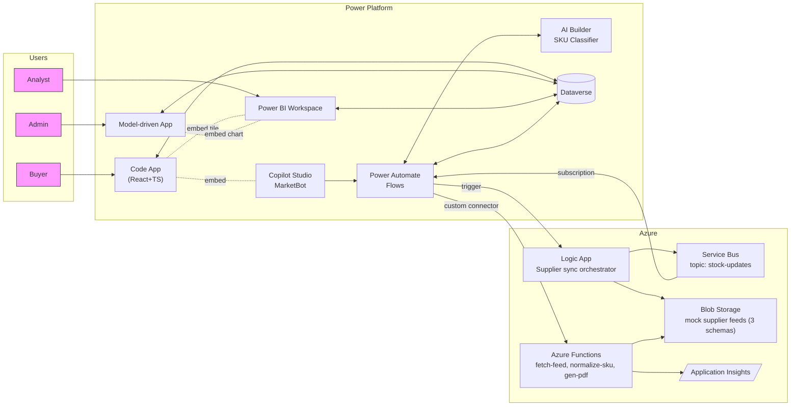
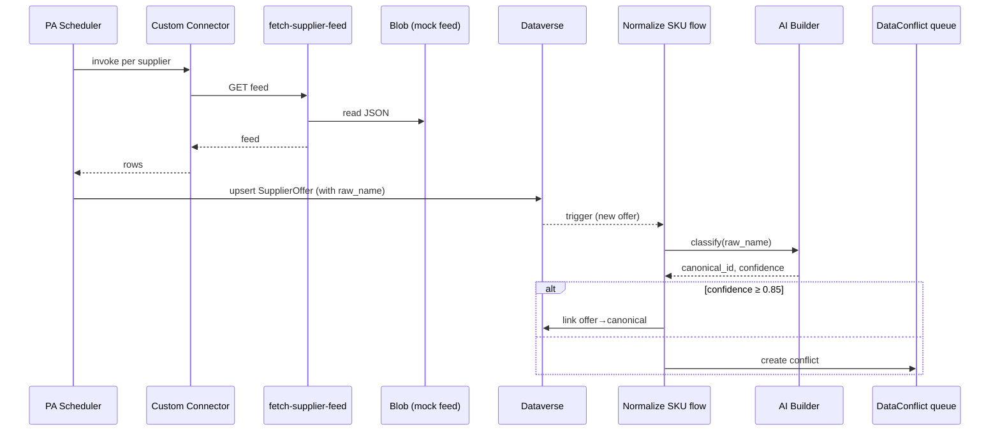

# Architecture

## Context

Buyers (mid-sized wholesale tire retailers) want one place to search inventory
across many heterogeneous supplier sources, get competitive prices, and
combine line items into a single procurement workflow. Suppliers publish
inventory in incompatible formats with inconsistent SKU naming. Operations
needs a way to normalize, govern, and analyze that data.

This system delivers:

1. A unified canonical product catalog over heterogeneous supplier feeds.
2. AI-assisted SKU normalization with admin review for low-confidence cases.
3. A multi-supplier purchasing experience for buyers, including RFQ/quote flow.
4. Regional/seasonal market intelligence on top of aggregated data.

## Personas & surfaces

| Persona | Surface | Stack |
|---|---|---|
| Buyer | **Power Apps Code App** | React + TypeScript + Vite + Fluent UI v9 + Power Apps SDK |
| Operations / Procurement Admin | **Model-driven App** on Dataverse | Forms, views, BPF, security roles |
| Market Analyst | **Power BI workspace** + embedded tiles | Dataverse direct query |
| Supplier (MVP3) | **Power Pages portal** | External Entra B2B + portal forms |

## High-level diagram

## Component responsibilities

### Power Platform layer

**Dataverse** — system of record. 12 entities. See `docs/data-model.md`.

**Buyer Code App** (`apps/buyer-code-app/`):
- `/` — Home: alerts, last order, KPIs
- `/search` — cross-supplier search; **headline feature**: one canonical SKU
  expands to N supplier offers sorted by total landed cost, with badges for
  in-stock / lead time / region
- `/cart` — multi-supplier cart, automatically split into per-supplier orders
- `/rfq/new` — RFQ composer, triggers `RFQ Broadcast` flow
- `/orders` — history with BPF tracker
- `/insights` — embedded Power BI tile (price trend for last search)
- Side panel: Copilot Studio chat (MarketBot)

**Operations Model-driven App**: three areas.
- Catalog: Suppliers, Canonical Products, Regions
- Operations: Orders (BPF), RFQs, Quotes, **Data Conflicts queue**, Audit
- Integrations: Import Jobs, Flow runs, Connector health

The **Data Conflicts queue** is a Kanban-style view (Pending / Suggested /
Auto-resolved) with a custom form action **"Suggest match"** that calls AI
Builder synchronously and lets the operator Approve/Reject.

**Power BI workspace** `B2BAgg-Analytics`. Reports:
1. Regional Demand & Forecast (DAX-driven seasonal extrapolation; not ML)
2. Supplier Scorecard (fill rate, price competitiveness, sync reliability)
3. Data Quality Trends (% auto-resolved, AI confidence distribution)
4. Top-moving SKUs by region

Datasource: Dataverse direct query. Tiles embedded in both Code App and MDA.

**Power Automate flows** (`B2BAgg.Integration` solution):
1. *Hourly Supplier Sync (parent)* — scheduled, dispatches to child flows
2. *Sync supplier (child)* — calls custom connector → Function → upserts offers
3. *Normalize SKU* — instant trigger on new/updated offer, calls AI Builder,
   creates a DataConflict if confidence < 0.85
4. *RFQ Broadcast* — button trigger from app, fan-out to suppliers, waits
   for Quotes or 24h timeout
5. *Order Approval BPF* — stage transitions, Teams notifications
6. *Low Stock Alert* — Dataverse trigger → Teams Adaptive Card
7. *Conflict Auto-Resolve Sweeper* — daily recompute of unresolved conflicts

**AI Builder**:
- Custom Text Classification model: raw supplier name → canonical product ID
  + confidence. Trained on ~150 labeled pairs. Threshold 0.85 for auto-resolve.
- (MVP3) Form Processing: PDF price-list → structured rows.

**Copilot Studio agent "MarketBot"**: embedded in Code App side panel.
Topics include product lookup, price comparison, RFQ creation, regional
demand queries. Calls Power Automate flows and Dataverse via generated actions.

### Azure layer

`rg-b2b-agg-demo` resource group, region matching Power Platform tenant.

- **Storage Account** with 3 Blob containers, each holding a JSON feed in a
  **different schema** (EN field names, RU/transliterated field names,
  pseudo-XML wrapped in JSON). This is the deliberate "real-world heterogeneity"
  signal — proves the architecture handles inconsistent inputs.
- **Azure Functions** (Consumption, Python 3.11):
  - `fetch-supplier-feed(supplier_id)` — returns the mock feed JSON
  - `normalize-sku(raw_name)` — deterministic fuzzy matcher with `rapidfuzz`,
    used as a fallback for AI Builder
  - `generate-quote-pdf(rfq_id)` — renders a PDF (reportlab) and uploads to Blob
- **Logic App** (Consumption): HTTP trigger → schema validation →
  publish to Service Bus topic
- **Service Bus**: namespace + topic `stock-updates`, two subscriptions
  (`to-power-automate`, `to-analytics`). See ADR-003 for Standard vs Basic.
- **Application Insights**: telemetry for Functions and Logic App
- **Custom connectors** (in PP): OpenAPI wrappers over the Functions, API
  key auth in dev (Service Principal in MVP3)

## Data flow — supplier sync (MVP2)

For MVP2 the *Logic App + Service Bus* path is added as an alternative push
ingestion: a supplier system POSTs to the Logic App, which validates and
publishes to the SB topic; a PA flow subscribes and runs the same downstream
normalization. This demonstrates two integration patterns (pull and push)
with the same back-end normalization.

## Security & roles

Dataverse security roles in `B2BAgg.Core`:

| Role | Read | Write | Delete | Notes |
|---|---|---|---|---|
| Buyer | own Orders/RFQs, all Products/Suppliers | own Orders/RFQs | — | Buyer Code App users |
| OperationsAdmin | all | all (except security) | own audit | MDA users |
| Analyst | all (read-only) | — | — | Power BI consumers |
| SystemAdmin | all | all | all | full control |

Authentication: Entra ID (Microsoft) tenant accounts. Service Principal for
GitHub Actions deployment (MVP3).

## ALM

See `docs/governance.md` for full detail.

Highlights:
- Three environments: Dev → Test → Prod (Developer-tier each, on the
  Power Platform Developer Plan).
- Three solutions: `B2BAgg.Core`, `B2BAgg.AI`, `B2BAgg.Integration`.
- **Two parallel deployment paths**, both demonstrated:
  1. Power Platform Pipelines (Dev → Test → Prod, configured in PP admin).
  2. GitHub Actions using `pac` CLI for solution pack/unpack, validation,
     and import.
- Solution checker as a PR check.

## Verification (per MVP)

### MVP1 smoke test
1. Open Buyer Code App → search "Michelin Pilot Sport 4" → see 2 supplier offers
2. Add to cart → submit order
3. In Operations MDA: see the new Order → open BPF → progress one stage
4. Manually run `Hourly Supplier Sync` flow → see `ImportJob` created

### MVP2 end-to-end test
1. POST a mock new-offer payload to the Logic App HTTP endpoint
2. Confirm message appears in Service Bus topic
3. Confirm PA subscriber flow runs and creates a SupplierOffer
4. Confirm `Normalize SKU` flow auto-resolves (confidence ≥ 0.85) OR creates
   a DataConflict (visible in MDA Kanban view)
5. Confirm Power BI report refresh shows the new offer in inventory totals
6. Use Copilot side panel: "compare Continental Premium 5 across suppliers"
   → assistant returns Adaptive Card with table

### MVP3 readiness
1. PR open → solution checker passes
2. `deploy-test.yml` manual dispatch → solution imported into Test
3. PP Pipelines page shows successful Dev → Test deployment
4. Supplier portal (Power Pages) login works for external test account
