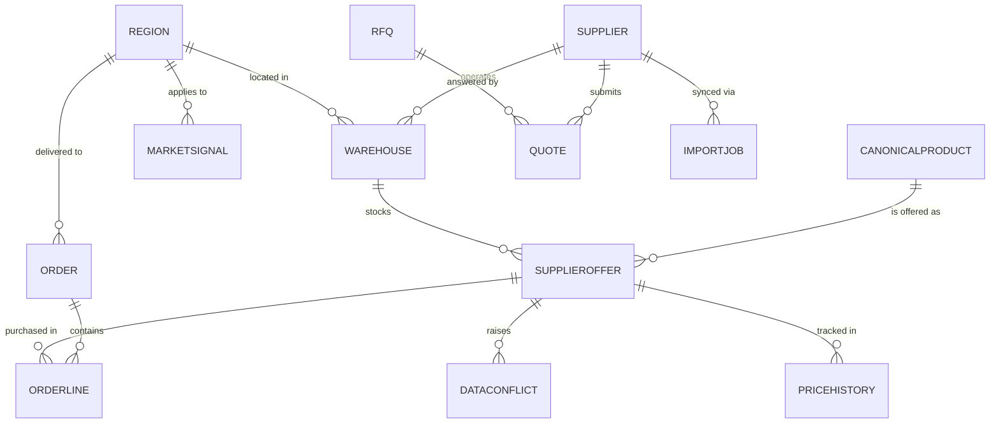

# Data model (Dataverse)

> ⚠️ **Non-authoritative / historical design doc.** This file captures the
> original 12-entity target model and uses older column spellings
> (`b2b_rawsku`, `b2b_country`, `b2b_leaddays`, …) that do **not** match the
> shipped schema. **The source of truth is
> [`docs/schema-canonical.md`](schema-canonical.md)** — 10 exported entities,
> `snake_case` logical names (`b2b_raw_sku`, `b2b_lead_time_days`; there is no
> `b2b_country`). Treat the ERD below as a roadmap sketch, not the built schema.
>
> **Warehouse ownership (audit A-1):** warehouses are **platform-owned regional
> distribution centres** (`b2b_warehouse → b2b_region`), *not* supplier-operated.
> A `b2b_supplieroffer` references both its `b2b_supplier` and the `b2b_warehouse`
> (regional DC) where that stock sits. The ERD line "SUPPLIER operates WAREHOUSE"
> below is superseded by this model.

> Solution publisher `b2bagg`, prefix `b2b_`. Every custom column uses the
> prefix.

## Entity relationship diagram

## Entities

### `b2b_region`
Federal district — top-level geography. 7 records in demo data.

| Column | Type | Notes |
|---|---|---|
| `b2b_name` | text | primary, e.g. "ЦФО" |
| `b2b_fullname` | text | full name, e.g. "Центральный федеральный округ" |
| `b2b_climatezone` | choice | Nord / Center / South / FarEast |

**Demo data — 7 федеральных округов:**

| Code | Full name | Climate |
|---|---|---|
| ЦФО | Центральный | Center |
| СЗФО | Северо-Западный | Nord |
| ЮФО+СКФО | Южный и Северо-Кавказский (объединены) | South |
| ПФО | Приволжский | Center |
| УрФО | Уральский | Nord |
| СФО | Сибирский | Nord |
| ДФО | Дальневосточный | FarEast |

---

### `b2b_supplier`
Wholesale supplier company (owner of warehouses and feeds).

| Column | Type | Notes |
|---|---|---|
| `b2b_name` | text | primary |
| `b2b_tier` | choice | Tier1 / Tier2 / Tier3 |
| `b2b_trustscore` | decimal | 0–1, weighted history of accuracy |
| `b2b_feedendpoint` | text | URL of mock API (Function endpoint) |
| `b2b_feedschema` | choice | ENFields / RUFields / PseudoXML — which blob schema |
| `b2b_lastsync` | datetime | |
| `b2b_active` | yes/no | |

**Demo data — 3 suppliers** (3 different feed schemas to demonstrate normalization):

| Supplier | Tier | Feed schema | Warehouses |
|---|---|---|---|
| МосАвтоШина | Tier1 | ENFields (English field names) | 8 |
| ТайрТрейд | Tier2 | RUFields (Russian/transliterated) | 7 |
| СибШина | Tier3 | PseudoXML (XML wrapped in JSON) | 5 |

---

### `b2b_warehouse`
A physical warehouse location operated by a supplier.
One supplier → many warehouses. One warehouse → many offers.

| Column | Type | Notes |
|---|---|---|
| `b2b_name` | text | primary, warehouse display name, e.g. "Рябиновая" |
| `b2b_supplier` | lookup → supplier | owner company |
| `b2b_region` | lookup → region | federal district |
| `b2b_city` | text | city name, e.g. "Москва" |
| `b2b_active` | yes/no | |

**Demo data — 20 warehouses distributed across 7 districts (proportional to population):**

| # | Supplier | Warehouse name | City | District |
|---|---|---|---|---|
| 1 | МосАвтоШина | Мосавтошина | Москва | ЦФО |
| 2 | МосАвтоШина | Рябиновая | Москва | ЦФО |
| 3 | МосАвтоШина | 8 Марта | Москва | ЦФО |
| 4 | МосАвтоШина | Воронеж | Воронеж | ЦФО |
| 5 | МосАвтоШина | Казанский | Казань | ПФО |
| 6 | МосАвтоШина | Нижегородский | Нижний Новгород | ПФО |
| 7 | МосАвтоШина | Петербургский | Санкт-Петербург | СЗФО |
| 8 | МосАвтоШина | Краснодарский | Краснодар | ЮФО+СКФО |
| 9 | ТайрТрейд | ТТ Москва | Москва | ЦФО |
| 10 | ТайрТрейд | ТТ Ярославль | Ярославль | ЦФО |
| 11 | ТайрТрейд | ТТ Северный | Санкт-Петербург | СЗФО |
| 12 | ТайрТрейд | ТТ Самара | Самара | ПФО |
| 13 | ТайрТрейд | ТТ Уфа | Уфа | ПФО |
| 14 | ТайрТрейд | ТТ Екатеринбург | Екатеринбург | УрФО |
| 15 | ТайрТрейд | ТТ Новосибирск | Новосибирск | СФО |
| 16 | СибШина | СШ Ростов | Ростов-на-Дону | ЮФО+СКФО |
| 17 | СибШина | СШ Ставрополь | Ставрополь | ЮФО+СКФО |
| 18 | СибШина | СШ Мурманск | Мурманск | СЗФО |
| 19 | СибШина | СШ Красноярск | Красноярск | СФО |
| 20 | СибШина | СШ Владивосток | Владивосток | ДФО |

**District summary:**

| District | Warehouses | Cities |
|---|---|---|
| ЦФО | 6 | Москва (×4), Воронеж, Ярославль |
| ПФО | 4 | Казань, Нижний Новгород, Самара, Уфа |
| СЗФО | 3 | Санкт-Петербург (×2), Мурманск |
| ЮФО+СКФО | 3 | Краснодар, Ростов-на-Дону, Ставрополь |
| СФО | 2 | Новосибирск, Красноярск |
| УрФО | 1 | Екатеринбург |
| ДФО | 1 | Владивосток |
| **Total** | **20** | |

---

### `b2b_canonicalproduct`
Single normalized SKU — the "truth" any supplier offer maps onto.

| Column | Type | Notes |
|---|---|---|
| `b2b_normalizedname` | text | primary, calc: `{brand} {model} {width}/{profile} R{diameter}` |
| `b2b_brand` | text | e.g. Michelin |
| `b2b_model` | text | e.g. Pilot Sport 4 |
| `b2b_season` | choice | Summer / WinterStudded / WinterFriction / AllSeason |
| `b2b_width` | int | mm |
| `b2b_profile` | int | % |
| `b2b_diameter` | int | inches |
| `b2b_loadindex` | int | e.g. 91 |
| `b2b_speedindex` | text | letter code, e.g. "T" |
| `b2b_ean` | text | EAN-13, unique |
| `b2b_image` | image | |

> **Note on `b2b_season`**: WinterStudded (шип) and WinterFriction (нешип)
> are separate choice values to support the season filter in the buyer UI.

---

### `b2b_supplieroffer`
A specific stock lot at a specific warehouse.
One warehouse can have multiple offers for the same canonical product
(e.g. different year of manufacture / price).

| Column | Type | Notes |
|---|---|---|
| `b2b_warehouse` | lookup → warehouse | **replaces direct supplier link** |
| `b2b_canonicalproduct` | lookup → canonicalproduct | **nullable** until normalized |
| `b2b_rawname` | text | as received from supplier feed |
| `b2b_rawsku` | text | supplier's own SKU |
| `b2b_price` | decimal | asking / base price |
| `b2b_buyerprice` | decimal | buyer's personal price (may be null = same as price) |
| `b2b_currency` | choice | USD / EUR / RUB |
| `b2b_stock` | int | quantity on hand |
| `b2b_year` | int | year of manufacture, e.g. 2023 |
| `b2b_country` | text | country of manufacture, e.g. "Россия", "Китай" |
| `b2b_leaddays` | int | shipping lead time in days |
| `b2b_stockdate` | datetime | date the stock figure was confirmed (актуальность) |
| `b2b_lastsynced` | datetime | when this record was last updated by sync |

> **Convenience computed column** (rollup or formula):
> `b2b_supplierid` — derived from `b2b_warehouse.b2b_supplier` for query performance.

---

### `b2b_dataconflict`
Unresolved normalization (AI confidence too low or none).

| Column | Type | Notes |
|---|---|---|
| `b2b_offer` | lookup → supplieroffer | |
| `b2b_type` | choice | SizeMismatch / BrandAlias / NewSKU / Other |
| `b2b_status` | choice | Pending / Suggested / AutoResolved / ManuallyResolved / Rejected |
| `b2b_aisuggestion` | lookup → canonicalproduct | nullable |
| `b2b_aiconfidence` | decimal | 0–1 |
| `b2b_resolvedcanonical` | lookup → canonicalproduct | nullable |
| `b2b_resolutionnotes` | multiline text | |

---

### `b2b_order`
Buyer purchase order (one per supplier after cart split).

| Column | Type | Notes |
|---|---|---|
| `b2b_ordernumber` | autonumber | primary, e.g. `ORD-000123` |
| `b2b_buyer` | lookup → systemuser | |
| `b2b_status` | choice | **driven by BPF stage** (Cart / Submitted / PO / Shipped / Fulfilled / Cancelled) |
| `b2b_total` | decimal | |
| `b2b_currency` | choice | USD / EUR / RUB |
| `b2b_region` | lookup → region | delivery region |
| `b2b_supplier` | lookup → supplier | one order per supplier after cart split |

**BPF**: `b2b_orderbpf` — Cart → Submitted → PO → Shipped → Fulfilled.

---

### `b2b_orderline`
Line item in an order.

| Column | Type | Notes |
|---|---|---|
| `b2b_order` | lookup → order | |
| `b2b_offer` | lookup → supplieroffer | |
| `b2b_qty` | int | |
| `b2b_unitprice` | decimal | snapshot at order time |

---

### `b2b_rfq`
Request for quotation from buyer to multiple suppliers.

| Column | Type | Notes |
|---|---|---|
| `b2b_buyer` | lookup → systemuser | |
| `b2b_status` | choice | Draft / Broadcast / Quoting / Closed |
| `b2b_deadline` | datetime | |
| `b2b_region` | lookup → region | |
| `b2b_notes` | multiline text | |

---

### `b2b_quote`
Supplier's response to an RFQ.

| Column | Type | Notes |
|---|---|---|
| `b2b_rfq` | lookup → rfq | |
| `b2b_supplier` | lookup → supplier | |
| `b2b_total` | decimal | |
| `b2b_validity` | datetime | |
| `b2b_status` | choice | Submitted / Accepted / Rejected / Expired |
| `b2b_quotefile` | file | PDF generated by Azure Function (MVP3) |

---

### `b2b_pricehistory`
Daily snapshot of offer prices for trend analytics.

| Column | Type | Notes |
|---|---|---|
| `b2b_offer` | lookup → supplieroffer | |
| `b2b_price` | decimal | |
| `b2b_recordedon` | datetime | |

---

### `b2b_marketsignal`
Aggregated demand or competitive signal for platform-owner analytics.

| Column | Type | Notes |
|---|---|---|
| `b2b_type` | choice | DemandSpike / Seasonal / StockShortage / RedistributionAdvice |
| `b2b_region` | lookup → region | affected district |
| `b2b_targetregion` | lookup → region | suggested source district (for RedistributionAdvice) |
| `b2b_severity` | choice | Info / Warning / Critical |
| `b2b_aisummary` | multiline text | optional, from Copilot / automated logic |
| `b2b_source` | text | which signal source generated it |
| `b2b_canonicalproduct` | lookup → canonicalproduct | nullable — specific SKU if applicable |

> **RedistributionAdvice** signals are generated by the
> *Stock Redistribution Advisor* flow (MVP2): when a district's total stock
> for a SKU falls below a threshold, the flow finds the adjacent district with
> the largest surplus and creates a RedistributionAdvice signal visible in MDA
> and Power BI.

---

### `b2b_importjob`
Audit of a single supplier sync run.

| Column | Type | Notes |
|---|---|---|
| `b2b_supplier` | lookup → supplier | |
| `b2b_status` | choice | Running / Success / Failed / PartialSuccess |
| `b2b_started` | datetime | |
| `b2b_finished` | datetime | |
| `b2b_recordsin` | int | total rows received |
| `b2b_conflicts` | int | how many ended up in DataConflict |
| `b2b_successrate` | decimal | calculated |
| `b2b_errordetail` | multiline text | when failed |

---

## Indexes / alternate keys

- `b2b_canonicalproduct.b2b_ean` — alternate key (unique)
- `b2b_supplier.b2b_name` — alternate key (unique)
- `b2b_warehouse` composite alt key: `b2b_supplier + b2b_city + b2b_name` (unique per supplier)
- `b2b_supplieroffer` composite alt key: `b2b_warehouse + b2b_rawsku` (for upsert idempotency)

## Audit

Audit enabled at the table level on: `b2b_supplier`, `b2b_warehouse`,
`b2b_canonicalproduct`, `b2b_supplieroffer`, `b2b_dataconflict`,
`b2b_order`, `b2b_rfq`, `b2b_quote`.

## Choices (global option sets)

| Option set | Values |
|---|---|
| `b2b_climatezone` | Nord / Center / South / FarEast |
| `b2b_currency` | USD / EUR / RUB |
| `b2b_tier` | Tier1 / Tier2 / Tier3 |
| `b2b_feedschema` | ENFields / RUFields / PseudoXML |
| `b2b_season` | Summer / WinterStudded / WinterFriction / AllSeason |
| `b2b_orderstatus` | Cart / Submitted / PO / Shipped / Fulfilled / Cancelled |
| `b2b_rfqstatus` | Draft / Broadcast / Quoting / Closed |
| `b2b_quotestatus` | Submitted / Accepted / Rejected / Expired |
| `b2b_conflicttype` | SizeMismatch / BrandAlias / NewSKU / Other |
| `b2b_conflictstatus` | Pending / Suggested / AutoResolved / ManuallyResolved / Rejected |
| `b2b_signaltype` | DemandSpike / Seasonal / StockShortage / RedistributionAdvice |
| `b2b_severity` | Info / Warning / Critical |
| `b2b_importstatus` | Running / Success / Failed / PartialSuccess |
