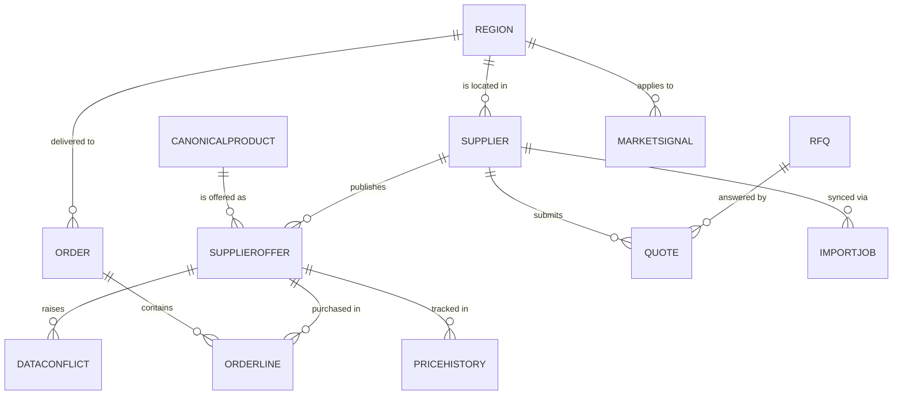

# Data model (Dataverse)

> Solution publisher `b2bagg`, prefix `b2b_`. Every custom column uses the
> prefix.

## Entity relationship diagram

## Entities

### `b2b_region`
Geographic region (Russia federal districts in demo data).

| Column | Type | Notes |
|---|---|---|
| `b2b_name` | text | primary, e.g. "Northwest" |
| `b2b_climatezone` | choice | Nord / Center / South / Caucasus / FarEast |

### `b2b_supplier`
Wholesale supplier (publisher of offers).

| Column | Type | Notes |
|---|---|---|
| `b2b_name` | text | primary |
| `b2b_region` | lookup → region | |
| `b2b_tier` | choice | Tier1 / Tier2 / Tier3 |
| `b2b_trustscore` | decimal | 0–1, weighted history of accuracy |
| `b2b_feedendpoint` | text | URL of mock API (Function endpoint) |
| `b2b_lastsync` | datetime | |
| `b2b_active` | yes/no | |

### `b2b_canonicalproduct`
Single normalized SKU (the "truth" any supplier offer maps onto).

| Column | Type | Notes |
|---|---|---|
| `b2b_normalizedname` | text | primary, calc: `{brand} {model} {width}/{profile} R{diameter}` |
| `b2b_brand` | text | e.g. Michelin |
| `b2b_model` | text | e.g. Pilot Sport 4 |
| `b2b_season` | choice | Summer / Winter / AllSeason |
| `b2b_width` | int | mm |
| `b2b_profile` | int | % |
| `b2b_diameter` | int | inches |
| `b2b_loadindex` | int | |
| `b2b_speedindex` | text | letter code |
| `b2b_ean` | text | EAN-13, unique |
| `b2b_image` | image | |

### `b2b_supplieroffer`
A supplier's offer for a (potentially unknown) product.

| Column | Type | Notes |
|---|---|---|
| `b2b_supplier` | lookup → supplier | |
| `b2b_canonicalproduct` | lookup → canonicalproduct | **nullable** until normalized |
| `b2b_rawname` | text | as received from supplier feed |
| `b2b_rawsku` | text | supplier's own SKU |
| `b2b_price` | decimal | |
| `b2b_currency` | choice | USD / EUR / RUB |
| `b2b_stock` | int | |
| `b2b_leaddays` | int | shipping lead time |
| `b2b_lastsynced` | datetime | |

### `b2b_dataconflict`
Unresolved normalization (AI confidence too low or none).

| Column | Type | Notes |
|---|---|---|
| `b2b_offer` | lookup → supplieroffer | |
| `b2b_type` | choice | SizeMismatch / BrandAlias / NewSKU / Other |
| `b2b_status` | choice | Pending / Suggested / AutoResolved / ManuallyResolved / Rejected |
| `b2b_aisuggestion` | lookup → canonicalproduct | nullable |
| `b2b_aiconfidence` | decimal | 0–1 |
| `b2b_resolvedcanonical` | lookup → canonicalproduct | nullable |
| `b2b_resolutionnotes` | multiline text | |

### `b2b_order`
Buyer purchase order.

| Column | Type | Notes |
|---|---|---|
| `b2b_ordernumber` | autonumber | primary, e.g. `ORD-000123` |
| `b2b_buyer` | lookup → systemuser | |
| `b2b_status` | choice | **driven by BPF stage** (Cart / Submitted / PO / Shipped / Fulfilled / Cancelled) |
| `b2b_total` | decimal | |
| `b2b_currency` | choice | USD / EUR / RUB |
| `b2b_region` | lookup → region | delivery region |
| `b2b_supplier` | lookup → supplier | when split per-supplier |

**BPF**: `b2b_orderbpf` — Cart → Submitted → PO → Shipped → Fulfilled.

### `b2b_orderline`
Line item in an order.

| Column | Type | Notes |
|---|---|---|
| `b2b_order` | lookup → order | |
| `b2b_offer` | lookup → supplieroffer | |
| `b2b_qty` | int | |
| `b2b_unitprice` | decimal | snapshot at order time |

### `b2b_rfq`
Request for quotation from buyer to multiple suppliers.

| Column | Type | Notes |
|---|---|---|
| `b2b_buyer` | lookup → systemuser | |
| `b2b_status` | choice | Draft / Broadcast / Quoting / Closed |
| `b2b_deadline` | datetime | |
| `b2b_region` | lookup → region | |
| `b2b_notes` | multiline text | |

### `b2b_quote`
Supplier's response to an RFQ.

| Column | Type | Notes |
|---|---|---|
| `b2b_rfq` | lookup → rfq | |
| `b2b_supplier` | lookup → supplier | |
| `b2b_total` | decimal | |
| `b2b_validity` | datetime | |
| `b2b_status` | choice | Submitted / Accepted / Rejected / Expired |
| `b2b_quotefile` | file | PDF generated by Azure Function (MVP3) |

### `b2b_pricehistory`
Daily snapshot of offer prices for trend analytics.

| Column | Type | Notes |
|---|---|---|
| `b2b_offer` | lookup → supplieroffer | |
| `b2b_price` | decimal | |
| `b2b_recordedon` | datetime | |

### `b2b_marketsignal`
Aggregated demand or competitive signal for analytics.

| Column | Type | Notes |
|---|---|---|
| `b2b_type` | choice | DemandSpike / Seasonal / CompetitorAlert / StockShortage |
| `b2b_region` | lookup → region | |
| `b2b_severity` | choice | Info / Warning / Critical |
| `b2b_aisummary` | multiline text | optional, from Copilot |
| `b2b_source` | text | which signal source generated it |

### `b2b_importjob`
Audit of a single supplier sync run.

| Column | Type | Notes |
|---|---|---|
| `b2b_supplier` | lookup → supplier | |
| `b2b_status` | choice | Running / Success / Failed / PartialSuccess |
| `b2b_started` | datetime | |
| `b2b_finished` | datetime | |
| `b2b_recordsin` | int | total rows received |
| `b2b_conflicts` | int | how many ended up in DataConflict |
| `b2b_successrate` | decimal | calculated |
| `b2b_errordetail` | multiline text | when failed |

## Indexes / alternate keys

- `b2b_canonicalproduct.b2b_ean` — alternate key (unique)
- `b2b_supplier.b2b_name` — alternate key (unique)
- `b2b_supplieroffer` composite alt key: `b2b_supplier + b2b_rawsku` (for upsert idempotency)

## Audit

Audit enabled at the table level on: `b2b_supplier`, `b2b_canonicalproduct`,
`b2b_supplieroffer`, `b2b_dataconflict`, `b2b_order`, `b2b_rfq`, `b2b_quote`.

## Choices (global option sets)

To be defined in solution: `b2b_climatezone`, `b2b_currency`, `b2b_tier`,
`b2b_season`, `b2b_orderstatus`, `b2b_rfqstatus`, `b2b_quotestatus`,
`b2b_conflicttype`, `b2b_conflictstatus`, `b2b_signaltype`, `b2b_severity`,
`b2b_importstatus`.
